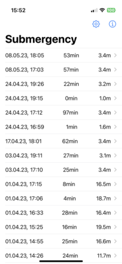
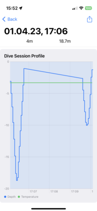

![Submergency][Submergency-logo]

[![badge-language]][swift.org]

# Submergency

Submergency: view and export your submerge data stored in your
HeathKit.

Submergency imports your submerge data stored in your iPhone's
HealthKit and reorganizes them as *dive sessions*.  The break between
two dive sessions can be configured.  You can view a dive session
as a chart and export it in [UDDF
format](https://www.streit.cc/resources/UDDF/v3.2.3/en/index.html).

## Screenshots

## License

This work is licensed under a [Creative Commons Attribution-Non Commercial-ShareAlike 4.0 International License](http://creativecommons.org/licenses/by-nc-sa/4.0/).

[Submergency-logo]: https://github.com/borisboesler/Submergency/raw/main/Screenshots/Submergency-Logo-150x150.png

[license]: http://creativecommons.org/licenses/by-nc-sa/4.0/

[swift.org]: https://swift.org/
[badge-language]: https://img.shields.io/badge/Swift-5.x-orange.svg?style=flat
